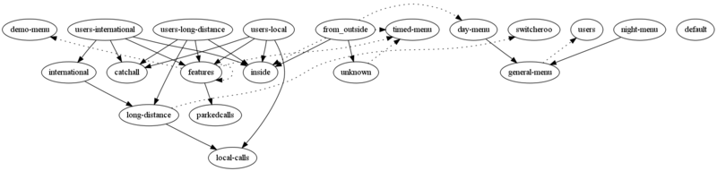

Astograph
---------

Astograph is a simple python tool to represent visually your Asterisk dialplan

It uses GraphViz to draw the links between included contexts

Example
-------

Considering this ``extensions.conf`` file:

.. include:: extensions.conf

and the following command:

  cat extensions.conf | ./astograph.py | dot -Tpng:cairo > graph.png

Make sure you have ``GraphViz`` installed for ``dot``, and you should get this:

Dotted lines mean Possible Gotos and solid lines mean Context inclusions.

You can pipe a bunch of extensions.conf files (if you've splitted them with #includes)

Second example
--------------

Here is another example, written in the Digium Advanced Training Class:

